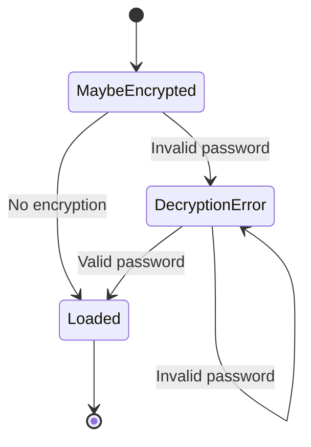
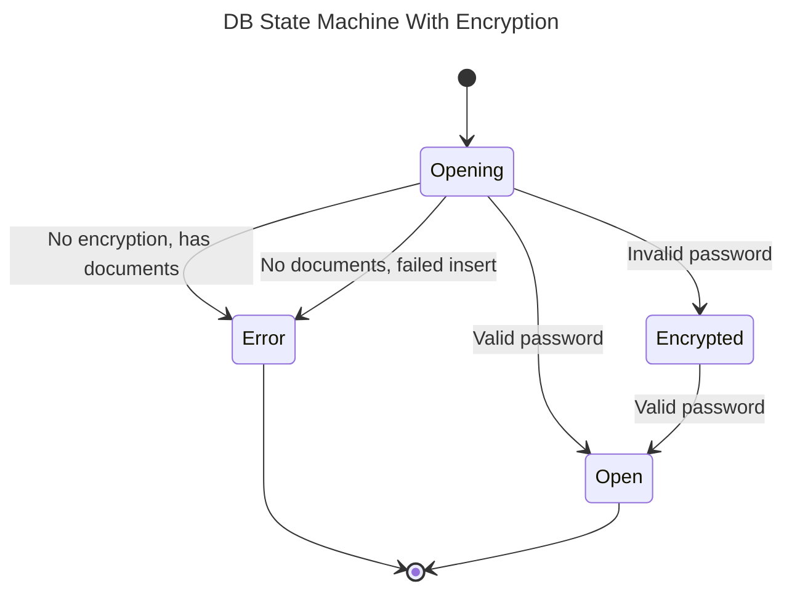
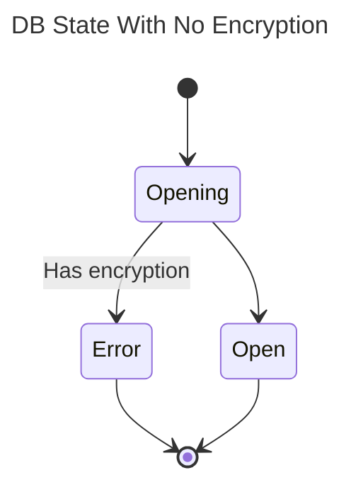

# Structure

This is a web application that runs in your browser.

So technically, it is all one big JavaScript application, because Elm compiles to JavaScript. But there is a logical division of the Elm App (or Elm runtime) and the JavaScript layer.

```

 |---------|                 |----------|
 |        --> subscriptions -->         |
 | Elm App |                 | JS Layer |
 |        <----- messages <----         |
 |---------|                 |----------|
```

The JavaScript Layer:

- It is the main entry-point. It builds the Elm application and hooks everything up (DOM, Elm, JavaScript parts)
- It contains the persistence abstraction, our `DbPort`
- It contains the "glue code" which connects our Elm world with the `DbPort`. It knows how to listen to events from Elm, call the corresponding functions in the `DbPort` and transform the responses back to Elm.

The Elm App is the one responsible for all the control-flow, rendering, business logic.

# Data Storage

Data is stored locally in the browser using [PouchDB](https://pouchdb.com/).



## Encrypting Database

0. Lock DB
1. Create empty encrypted DB
2. Store `{"_id": "_encryption", "version": 1 }`
3. Copy all data
4. Rename
5. Unlock DB

## Opening DB

1. Open DB
2. GET `_encryption`
3. TryToDecrypt





## DB Operations

- Open Unencrypted DB (`Success | MaybeEncrypted`)
- Open Encrypted DB (`Error | Success`)
- GET Txn
- PUT Txn
- DELETE Txn
- getPage Txn
- GET Settings
- PUT Settings
