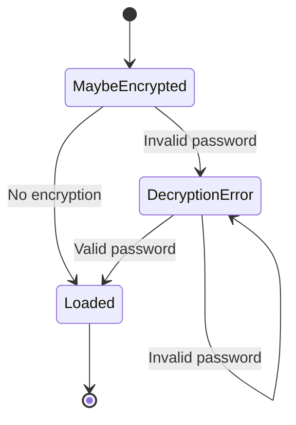
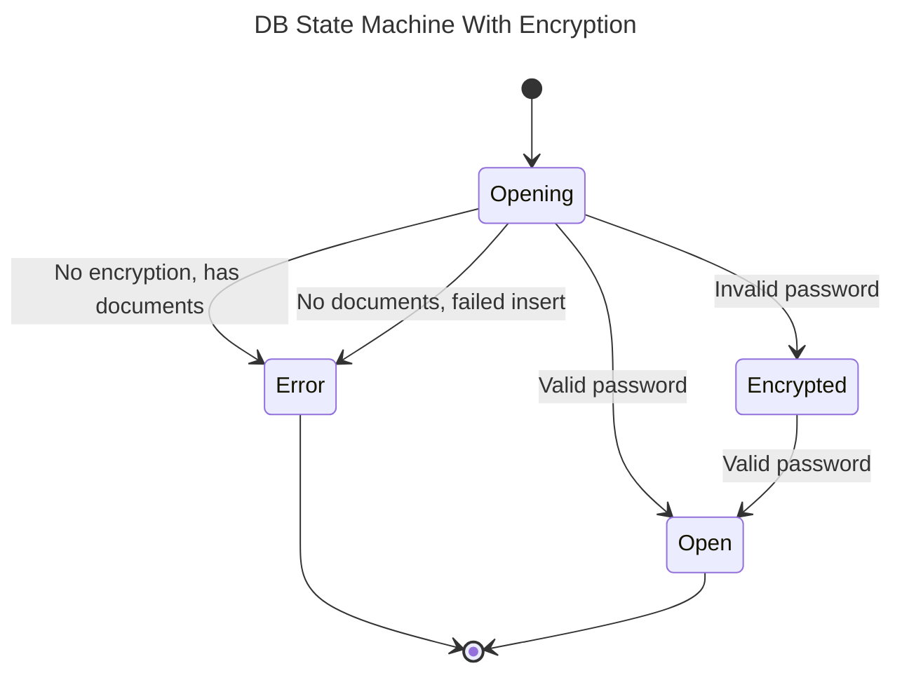
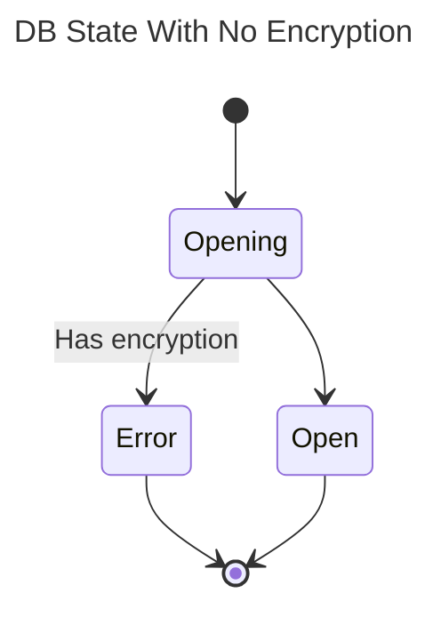

# Data Storage

Data is stored locally in the browser using [PouchDB](https://pouchdb.com/).

## Encrypting Database

0. Lock DB
1. Create empty encrypted DB
2. Store `{"_id": "_encryption", "version": 1 }`
3. Copy all data
4. Rename
5. Unlock DB

## Opening DB

1. Open DB
2. GET `_encryption`
3. TryToDecrypt

